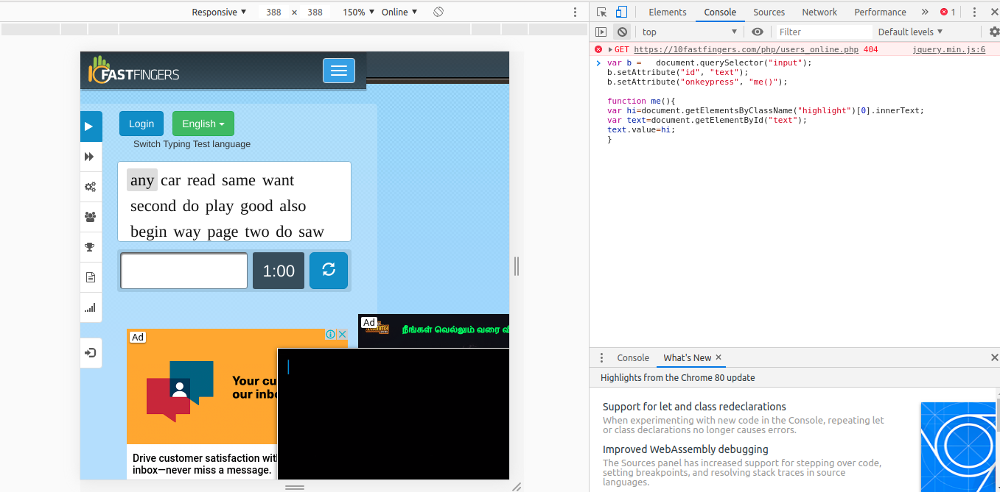

# Typing Test hack code

Copy past the below code in console.

var b =   document.querySelector("input");
b.setAttribute("id", "text");
b.setAttribute("onkeypress", "me()");

function me(){
var hi=document.getElementsByClassName("highlight")[0].innerText;
var text=document.getElementById("text");
text.value=hi;
}

  
  

youtube video:https://www.youtube.com/watch?v=nT9VEOwl3g8
